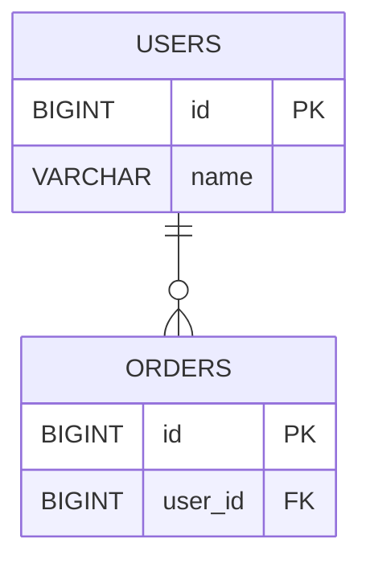

# erdMaid

**Export real database tables as Mermaid ER diagrams from JetBrains IDEs.**

erdMaid is a JetBrains IDE plugin that turns table metadata already available in the Database tool window into Mermaid `erDiagram` syntax. It is intended for developers who want to move real schema structure into Markdown, documentation, and architecture notes without rewriting table definitions by hand.

> **Status:** Active development. Marketplace publication and repository consolidation are still in progress.

## What it does

- Export every table in a schema's `Tables` node or only selected tables.
- Preserve the column order reported by database metadata.
- Include primary keys and foreign-key relationships.
- Include column types and comments.
- Render size, precision, and scale in a Mermaid-safe representation.
- Copy the generated Mermaid directly to the clipboard.
- Work inside IntelliJ IDEA Ultimate, DataGrip, and compatible JetBrains IDEs with database tooling.

## Typical workflow

1. Open the **Database** tool window.
2. Expand a schema and its `Tables` node.
3. Select the `Tables` node to export the schema's tables, or select individual tables.
4. Choose **Export as Mermaid ERD (erdMaid)**.
5. Paste the generated Mermaid into Markdown, documentation, or another Mermaid-enabled editor.

## Example output

Given tables such as `users` and `orders`, erdMaid produces ordinary Mermaid `erDiagram` syntax that can be rendered by any compatible Mermaid viewer:

The exact output is derived from the metadata reported by the IDE for the selected database objects.

## Output rules

- Table comments are emitted as Mermaid comments.
- Column order follows database metadata.
- Column types are normalized where required for Mermaid parsing.
- Column comments are sanitized so generated syntax remains parseable.
- Numeric precision, scale, and size information use Mermaid-safe formatting.
- Relationships are derived from foreign-key metadata.

## Scope

The project currently focuses on **database tables → Mermaid ER diagrams**.

Views, `classDiagram`, and alternative diagram formats are intentionally outside the current scope rather than incomplete promises.

## Requirements

- IntelliJ IDEA Ultimate, DataGrip, or another IntelliJ-based IDE with database tooling.
- A configured database connection with table metadata available in the Database tool window.

## Installation

erdMaid is not yet published to JetBrains Marketplace.

Development builds can be installed from disk using the generated plugin distribution. Marketplace installation instructions will be added after publication.

## Project direction

Current work focuses on compatibility hardening, release packaging, repository consolidation, and Marketplace publication while keeping the plugin deliberately small and database-metadata driven.
